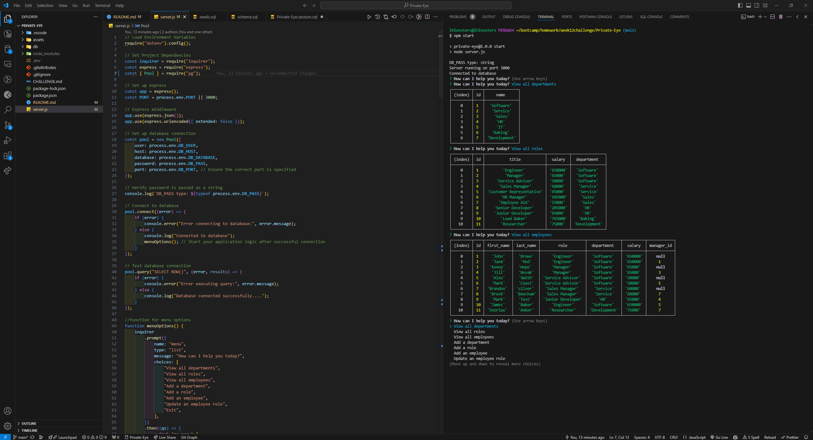

# Private Eye

## Table of Contents

* [Description](#description)
* [Languages](#languages)
* [Features](#features)
* [Usage](#usage)
* [Demonstration](#demonstration)
* [License](#license)  

## Description

 CLI based employee management tool that allows you to manage different departments, roles and employees in your company. Giving you an array of options to view, update and add new employees, departments, and roles including salaries.

## Languages

*   
* 

## Features

* **Interactive Menu Options:** Users are given clear menu options on startup, allowing for easy menu use.
* **Comprehensive Data Viewing:** Displays all data including departments, roles with salaries, and employees for easy viewing.
* **Data Insertion:** allows users to add new departments, roles, and employees. Options for salaries and managers as well.
* **Updates:**  Enables users to update and employee's role, allowing for flexible employee assignments.

## Usage

* npm install to load all necessary packages.
* npm start or node server.js will launch the application

* [Private-Eye-Repo](https://github.com/IVIonsters/Private-Eye)

## Demonstration

* Video Thumbnail - Click to Watch ⇩⇩

* Screenshot

## License

